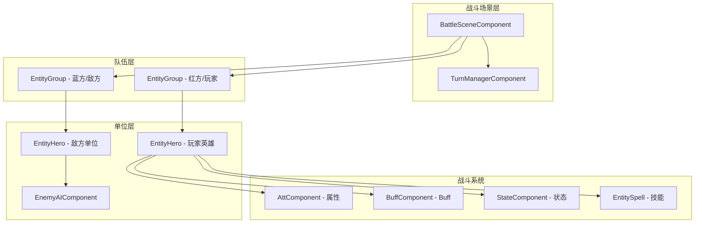
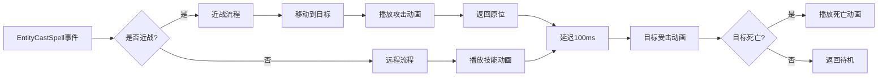

# cn.etetet.battle 回合制战斗流程分析

## 概述

`cn.etetet.battle` 包实现了一套基于**三消(Match3)驱动**的回合制战斗系统。玩家通过三消操作触发英雄攻击和技能释放，敌方则按照AI逻辑自动行动。

---

## 核心架构



---

## 回合阶段定义

| 阶段 | 枚举值 | 说明 |
|------|--------|------|
| **WaitingPlayerInput** | 0 | 等待玩家三消操作 |
| **PlayerAction** | 1 | 玩家英雄执行攻击/技能 |
| **EnemyAction** | 2 | 敌方单位自动行动 |
| **TurnEnd** | 3 | 回合结束处理 |

---

## 战斗流程图

```mermaid
flowchart TD
    START([战斗开始]) --> INIT[初始化战斗场景]
    INIT --> CREATE_GROUPS[创建红蓝两个EntityGroup]
    CREATE_GROUPS --> INIT_HEROES[初始化玩家英雄]
    INIT_HEROES --> INIT_ENEMIES[初始化敌方单位]
    INIT_ENEMIES --> START_TURN[开始回合 Turn=1]
    
    START_TURN --> WAIT_INPUT[📱 等待玩家三消操作<br/>WaitingPlayerInput]
    
    WAIT_INPUT --> |Match3BattleTriggerEvent| MATCH3_TRIGGER{三消触发}
    
    MATCH3_TRIGGER --> FIND_HERO[根据糖果颜色找到对应英雄]
    FIND_HERO --> ADD_ENERGY[增加英雄能量<br/>+matchCount]
    ADD_ENERGY --> PLAYER_ACTION[进入玩家行动阶段<br/>PlayerAction]
    
    PLAYER_ACTION --> IS_SKILL{是否技能糖果?}
    IS_SKILL --> |是| NORMAL_SPELL[释放小技能 NormalSpell<br/>次数=消除数量]
    IS_SKILL --> |否| NORMAL_DAMAGE[普通糖果直接伤害<br/>伤害=攻击*消除数量]
    
    NORMAL_SPELL --> CHECK_FULL_ENERGY{能量是否满?}
    NORMAL_DAMAGE --> CHECK_FULL_ENERGY
    
    CHECK_FULL_ENERGY --> |是| SPECIAL_SPELL[释放大技能 SpecialSpell<br/>能量清零]
    CHECK_FULL_ENERGY --> |否| CHECK_BATTLE_END1
    SPECIAL_SPELL --> CHECK_BATTLE_END1{检查战斗结束?}
    
    CHECK_BATTLE_END1 --> |敌方全灭| VICTORY([🏆 胜利])
    CHECK_BATTLE_END1 --> |我方全灭| DEFEAT([💀 失败])
    CHECK_BATTLE_END1 --> |继续| ENEMY_TURN[进入敌方回合<br/>EnemyAction]
    
    subgraph "敌方回合处理"
        ENEMY_TURN --> ENEMY_LOOP[遍历每个敌方单位]
        ENEMY_LOOP --> ENEMY_ADD_ENERGY[增加能量<br/>+EnergyPerTurn]
        ENEMY_ADD_ENERGY --> CHECK_COOLDOWN{攻击冷却?}
        CHECK_COOLDOWN --> |冷却=0| ENEMY_ATTACK[执行普通攻击<br/>重置冷却]
        CHECK_COOLDOWN --> |冷却>0| COOLDOWN_DEC[冷却-1]
        ENEMY_ATTACK --> CHECK_ENEMY_FULL{能量满?}
        COOLDOWN_DEC --> CHECK_ENEMY_FULL
        CHECK_ENEMY_FULL --> |是| ENEMY_SKILL[释放技能<br/>能量清零]
        CHECK_ENEMY_FULL --> |否| NEXT_ENEMY
        ENEMY_SKILL --> NEXT_ENEMY{还有敌人?}
        NEXT_ENEMY --> |是| ENEMY_LOOP
        NEXT_ENEMY --> |否| TURN_END
    end
    
    TURN_END[回合结束<br/>TurnEnd] --> CHECK_BATTLE_END2{检查战斗结束?}
    CHECK_BATTLE_END2 --> |敌方全灭| VICTORY
    CHECK_BATTLE_END2 --> |我方全灭| DEFEAT
    CHECK_BATTLE_END2 --> |继续| NEXT_TURN[Turn++ 下一回合]
    NEXT_TURN --> CHECK_TURN_LIMIT{回合超限?}
    CHECK_TURN_LIMIT --> |是| TURN_LIMIT([⏰ 回合耗尽])
    CHECK_TURN_LIMIT --> |否| WAIT_INPUT
```



---

## 核心组件详解

### 1. BattleSceneComponent
> 路径: [BattleSceneComponent.cs](file:///Users/lilei/Work/ET9_StateSync/Packages/cn.etetet.battle/Scripts/Model/Share/BattleSceneComponent.cs)

战斗场景的核心管理组件，挂载在 `Scene` 上。

| 字段 | 类型 | 说明 |
|------|------|------|
| `LevelId` | int | 当前关卡ID |
| `CurrentTurn` | int | 当前回合数 |
| `BattleState` | int | 战斗状态(0准备/1进行/2胜利/3失败) |
| `RedGroup` | EntityRef | 玩家队伍 |
| `BlueGroup` | EntityRef | 敌方队伍 |

---

### 2. TurnManagerComponent
> 路径: [TurnManagerComponent.cs](file:///Users/lilei/Work/ET9_StateSync/Packages/cn.etetet.battle/Scripts/Model/Share/TurnManagerComponent.cs)

回合管理器，控制战斗流程。

| 字段 | 类型 | 说明 |
|------|------|------|
| `CurrentTurn` | int | 当前回合数 |
| `MaxTurns` | int | 最大回合数(默认30) |
| `IsBattleRunning` | bool | 战斗进行中标记 |
| `CurrentPhase` | ETurnPhase | 当前回合阶段 |
| `BattleResult` | EBattleResult | 战斗结果 |

**核心方法** (在 [TurnManagerComponentSystem.cs](file:///Users/lilei/Work/ET9_StateSync/Packages/cn.etetet.battle/Scripts/Hotfix/Share/TurnManagerComponentSystem.cs)):

| 方法 | 说明 |
|------|------|
| `StartBattle(maxTurns)` | 开始战斗 |
| `EndBattle(result)` | 结束战斗 |
| `OnMatch3Combo(color, count, isSkill)` | 处理三消触发 |
| `ProcessEnemyTurn()` | 处理敌方回合 |
| `NextTurn()` | 进入下一回合 |
| `CheckBattleEnd()` | 检查战斗结束条件 |

---

### 3. EntityHero
> 路径: [EntityHero.cs](file:///Users/lilei/Work/ET9_StateSync/Packages/cn.etetet.battle/Scripts/Model/Share/EntityHero.cs)

英雄/敌方单位实体。

| 字段 | 类型 | 说明 |
|------|------|------|
| `HeroId` | int | 英雄配置ID |
| `HeroColor` | int | 对应糖果颜色 |
| `Energy` | int | 当前能量 |
| `MaxEnergy` | int | 满能量值 |
| `Entry` | DREntityBaseEntry | 静态配置(含技能ID) |
| `AttCom` | EntityRef | 属性组件引用 |
| `StateCom` | EntityRef | 状态组件引用 |

---

### 4. EnemyAIComponent
> 路径: [EnemyAIComponent.cs](file:///Users/lilei/Work/ET9_StateSync/Packages/cn.etetet.battle/Scripts/Model/Share/EnemyAIComponent.cs)

敌方AI控制组件。

| 字段 | 类型 | 说明 |
|------|------|------|
| `AttackInterval` | int | 普攻间隔回合数 |
| `AttackCooldown` | int | 当前冷却(0时可攻击) |
| `EnergyPerTurn` | int | 每回合能量增加 |

---

## 技能系统

### 技能类型 (EEntitySpellType)

| 类型 | 值 | 说明 | 触发条件 |
|------|-----|------|----------|
| `Melee` | 0 | 普通攻击 | 敌方AI普攻 |
| `Normal` | 1 | 小技能 | 技能糖果消除 |
| `Special` | 2 | 大技能 | 能量满时自动释放 |

### 技能释放顺序

```
普通糖果消除 → 直接伤害(不触发Melee)
技能糖果消除 → NormalSpell × 消除数量
能量满 → SpecialSpell → 能量清零
```

---

## 事件系统

### 发布的事件

| 事件 | 触发时机 | 携带数据 |
|------|----------|----------|
| `TurnChangedEvent` | 回合变化时 | Turn, MaxTurns |
| `EnergyChangedEvent` | 能量变化时 | HeroId, OldEnergy, NewEnergy, MaxEnergy |
| `EntityCastSpell` | 技能释放时 | CasterId, SpellId, DamageInfos |
| `BuffAddedEvent` | Buff添加时 | TargetId, BuffId, StackCount |
| `BuffRemovedEvent` | Buff移除时 | TargetId, BuffId |
| `BattleEndEvent` | 战斗结束时 | IsVictory |

### 订阅的事件

| 事件 | 来源 | 处理 |
|------|------|------|
| `Match3BattleTriggerEvent` | cn.etetet.match3 | 触发`OnMatch3Combo` |

---

## 伤害计算公式

```csharp
// 普通糖果直接伤害
int attack = attackerAtt.GetAttValue(EAttType.AttackMelee);
int defence = targetAtt.GetAttValue(EAttType.DefenceMelee);
int baseDamage = (int)(attack / (1.0 * defence + attack) * attack);
int totalDamage = baseDamage * 消除数量;
```

---

## 战斗结束条件

| 结果 | 条件 |
|------|------|
| `Victory` | 敌方队伍全部阵亡 |
| `Defeat` | 我方队伍全部阵亡 |
| `TurnLimit` | 回合数超过MaxTurns |

---

## 文件结构总览

```
cn.etetet.battle/Scripts/
├── Model/Share/
│   ├── BattleSceneComponent.cs      # 战斗场景组件
│   ├── TurnManagerComponent.cs      # 回合管理器
│   ├── EntityGroup.cs               # 队伍组件
│   ├── EntityHero.cs                # 英雄实体
│   ├── EntitySpell.cs               # 技能实体
│   ├── EnemyAIComponent.cs          # 敌方AI
│   ├── AttComponent.cs              # 属性组件
│   ├── StateComponent.cs            # 状态组件
│   ├── BuffComponent.cs             # Buff组件
│   └── BattleEvent.cs               # 事件定义
├── Hotfix/Share/
│   ├── BattleSceneComponentSystem.cs    # 战斗场景逻辑
│   ├── TurnManagerComponentSystem.cs    # 回合管理逻辑(核心)
│   ├── EntityHeroSystem.cs              # 英雄逻辑
│   ├── EntitySpellSystem.cs             # 技能逻辑
│   ├── EntityGroupSystem.cs             # 队伍逻辑
│   └── BuffComponentSystem.cs           # Buff逻辑
└── HotfixView/Client/
    ├── EntityCastSpellEventHandler.cs   # 技能事件处理器
    ├── SpellEffectHelper.cs             # 技能效果辅助类
    └── Hero/
        ├── BattleCharacterViewComponentSystem.cs
        └── AfterEntityHeroCreate_CreateHeroView.cs
```

---

## 客户端视图效果

### 技能动画流程



### 动画类型

| 技能类型 | 施法者动画 | 目标动画 |
|---------|-----------|----------|
| Melee（普攻） | Attack | Hit |
| Normal/Special（技能） | Spell | Hit |
| 死亡 | - | Die |

---

## 待扩展功能

1. **关卡配置系统** - 根据关卡ID加载英雄和敌人配置
2. **弹道特效** - 远程攻击的飞行弹道
3. **音效系统** - 攻击/受击/技能音效
4. **UI增强** - 伤害飘字、血条更新、能量显示
5. **Buff视觉** - Buff图标和特效
