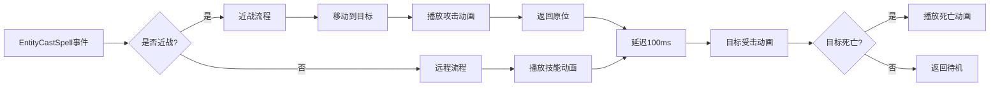

# 技能效果客户端逻辑实现总结

## 实现概述

为`cn.etetet.battle`包的HotfixView层实现了完整的技能效果客户端逻辑，通过订阅[EntityCastSpell](file:///Users/lilei/Work/ET9_StateSync/Packages/cn.etetet.battle/Scripts/Model/Share/BattleEvent.cs#30-36)事件驱动角色动画播放，支持近战移动攻击和远程攻击，以及目标受击和死亡表现。

---

## 创建的文件

### 1. [SpellEffectHelper.cs](file:///Users/lilei/Work/ET9_StateSync/Packages/cn.etetet.battle/Scripts/HotfixView/Client/SpellEffectHelper.cs)

**技能效果辅助类** - 提供复用的视图逻辑

| 方法 | 功能 |
|------|------|
| [FindHeroByHeroId(scene, heroId)](file:///Users/lilei/Work/ET9_StateSync/Packages/cn.etetet.battle/Scripts/HotfixView/Client/SpellEffectHelper.cs#14-52) | 根据HeroId遍历红蓝队伍查找EntityHero |
| [FindHeroByEntityId(scene, entityId)](file:///Users/lilei/Work/ET9_StateSync/Packages/cn.etetet.battle/Scripts/HotfixView/Client/SpellEffectHelper.cs#53-91) | 根据Entity.Id查找EntityHero |
| [IsMeleeAttack(spellId)](file:///Users/lilei/Work/ET9_StateSync/Packages/cn.etetet.battle/Scripts/HotfixView/Client/SpellEffectHelper.cs#92-110) | 判断是否近战攻击（基于SpellType） |
| [IsNormalAttack(spellId)](file:///Users/lilei/Work/ET9_StateSync/Packages/cn.etetet.battle/Scripts/HotfixView/Client/SpellEffectHelper.cs#111-128) | 判断是否普通攻击（决定Attack/Spell动画） |
| [IsDead(hero)](file:///Users/lilei/Work/ET9_StateSync/Packages/cn.etetet.battle/Scripts/HotfixView/Client/SpellEffectHelper.cs#129-146) | 检查HP是否<=0 |
| [GetViewComponent(hero)](file:///Users/lilei/Work/ET9_StateSync/Packages/cn.etetet.battle/Scripts/HotfixView/Client/SpellEffectHelper.cs#147-156) | 获取BattleCharacterViewComponent |

---

### 2. [EntityCastSpellEventHandler.cs](file:///Users/lilei/Work/ET9_StateSync/Packages/cn.etetet.battle/Scripts/HotfixView/Client/EntityCastSpellEventHandler.cs)

**技能释放事件处理器** - 订阅[EntityCastSpell](file:///Users/lilei/Work/ET9_StateSync/Packages/cn.etetet.battle/Scripts/Model/Share/BattleEvent.cs#30-36)事件

#### 核心流程



#### 私有方法

| 方法 | 说明 |
|------|------|
| [ProcessMeleeAttack()](file:///Users/lilei/Work/ET9_StateSync/Packages/cn.etetet.battle/Scripts/HotfixView/Client/EntityCastSpellEventHandler.cs#79-114) | 近战流程：移动→攻击→返回 |
| [ProcessRangedAttack()](file:///Users/lilei/Work/ET9_StateSync/Packages/cn.etetet.battle/Scripts/HotfixView/Client/EntityCastSpellEventHandler.cs#115-142) | 远程流程：播放动画，预留弹道接口 |
| [ProcessTargetHit()](file:///Users/lilei/Work/ET9_StateSync/Packages/cn.etetet.battle/Scripts/HotfixView/Client/EntityCastSpellEventHandler.cs#143-179) | 目标受击：播放Hit或Die动画 |

---

## 修改的文件

### 1. [BattleCharacterViewComponent.cs](file:///Users/lilei/Work/ET9_StateSync/Packages/cn.etetet.battle/Scripts/ModelView/Client/BattleCharacterViewComponent.cs)

**添加字段**：
```csharp
/// <summary>
/// 原始位置（用于近战攻击后返回）
/// </summary>
public Vector3 OriginalPosition;
```

---

### 2. [BattleCharacterViewComponentSystem.cs](file:///Users/lilei/Work/ET9_StateSync/Packages/cn.etetet.battle/Scripts/HotfixView/Client/Hero/BattleCharacterViewComponentSystem.cs)

**添加移动相关方法**：

| 方法 | 功能 |
|------|------|
| [MoveToPosition(targetPosition, moveSpeed)](file:///Users/lilei/Work/ET9_StateSync/Packages/cn.etetet.battle/Scripts/HotfixView/Client/Hero/BattleCharacterViewComponentSystem.cs#259-301) | 使用Lerp平滑移动到目标位置，播放Run动画 |
| [MoveBack(moveSpeed)](file:///Users/lilei/Work/ET9_StateSync/Packages/cn.etetet.battle/Scripts/HotfixView/Client/Hero/BattleCharacterViewComponentSystem.cs#302-322) | 返回OriginalPosition，完成后播放Idle动画 |

**修改Initialize方法**：
- 在创建时保存`OriginalPosition = characterGO.transform.position`

---

## 核心功能

### 1. 动画分配策略

| 技能类型 | 施法者动画 | 说明 |
|---------|-----------|------|
| Melee（普攻） | Attack | 正常攻击动画 |
| Normal/Special（技能） | Spell | 技能施法动画 |

### 2. 近战攻击流程

```csharp
// 1. 计算冲向目标的位置
Vector3 moveToPos = targetPos + direction * 0.5f;

// 2. 移动到目标（速度8单位/秒）
await casterView.MoveToPosition(moveToPos, 8f);

// 3. 播放攻击动画
await casterView.PlayAttack(); // 或 PlaySpell()

// 4. 返回原位（速度8单位/秒）
await casterView.MoveBack(8f);
```

### 3. 远程攻击流程

```csharp
// 1. 播放技能动画
await casterView.PlaySpell(); // 或 PlayAttack()

// 2. TODO: 添加弹道特效（预留接口）

// 3. 返回待机
casterView.PlayIdle();
```

### 4. 目标受击处理

```csharp
// 1. 播放受击动画
await targetView.PlayHit();

// 2. 检查是否死亡
if (SpellEffectHelper.IsDead(target))
{
    // 播放死亡动画
    await targetView.PlayDie();
}
else
{
    // 返回待机
    targetView.PlayIdle();
}
```

---

## 技术细节

### EntityRef使用规范

所有异步方法都遵循ET框架的EntityRef规范：

```csharp
public static async ETTask MoveToPosition(this BattleCharacterViewComponent self, ...)
{
    // 1. 在await前创建EntityRef
    EntityRef<BattleCharacterViewComponent> selfRef = self;
    
    // 2. 异步操作
    await SomeAsyncOperation();
    
    // 3. await后重新获取Entity
    self = selfRef;
    if (self == null || self.IsDisposed)
        return;
    
    // 4. 使用Entity
    self.DoSomething();
}
```

### 动画延迟控制

- **施法→受击**：100ms延迟，避免视觉冲突
- **移动速度**：8单位/秒，保证攻击节奏感
- **帧等待**：`WaitFrameAsync()` 实现平滑移动

### 位置计算

```csharp
// 计算冲向目标的停止位置（距离目标0.5单位）
Vector3 direction = (casterPos - targetPos).normalized;
Vector3 attackPos = targetPos + direction * 0.5f;
```

---

## 文件变更总结

```
[NEW] Scripts/HotfixView/Client/SpellEffectHelper.cs
[NEW] Scripts/HotfixView/Client/EntityCastSpellEventHandler.cs
[MODIFY] Scripts/ModelView/Client/BattleCharacterViewComponent.cs
[MODIFY] Scripts/HotfixView/Client/Hero/BattleCharacterViewComponentSystem.cs
```

---

## 后续优化建议

1. **弹道特效**
   - 创建`ProjectileComponent`
   - 飞行弹道GameObject
   - 命中回调机制

2. **音效集成**
   - 攻击音效（刀剑声、魔法声）
   - 受击音效（闷击声）
   - 死亡音效

3. **视觉增强**
   - 伤害飘字数字
   - 暴击/格挡特殊表现
   - 技能特效粒子系统

4. **性能优化**
   - 对象池管理弹道GameObject
   - 减少频繁的FindHero查找

---

## 测试指导

### 手动测试步骤

1. **启动Unity编辑器**，运行包含三消和战斗的测试关卡
2. **执行三消操作**，消除糖果触发技能
3. **观察预期效果**：
   - ✅ 近战英雄冲向目标→播放攻击动画→返回原位
   - ✅ 远程英雄播放技能动画（站在原地）
   - ✅ 目标播放受击动画
   - ✅ 目标HP归零后播放死亡动画并保持死亡状态
   - ✅ Console有`[EntityCastSpellEventHandler]`相关Log输出

### 可能遇到的问题

| 问题 | 原因 | 解决方案 |
|------|------|----------|
| 角色不移动 | OriginalPosition未正确保存 | 检查Initialize是否在正确时机调用 |
| 找不到目标英雄 | HeroId不匹配 | 检查DamageInfo中的TargetId是否正确 |
| 动画不播放 | Animancer组件缺失 | 检查角色预制体是否包含BattleCharacterAnimancer |
| 死亡后复活 | 未检查IsDisposed | 确保await后检查Entity有效性 |

---

## 遵循的ET框架规范

✅ **Entity-System分离**：数据在Component，逻辑在System  
✅ **EntityRef规范**：await后通过EntityRef重新获取Entity  
✅ **FriendOf特性**：System访问Entity私有字段  
✅ **事件驱动**：通过EventSystem解耦模块  
✅ **异步编程**：使用ETTask代替Task  
✅ **中文注释**：所有代码都有详细中文注释
